# Certificate Tampering Detection - Comprehensive Project Report

## 📋 Executive Summary

The **Certificate Tampering Detection** system is a secure, blockchain-based certificate verification system designed to issue, manage, and verify academic certificates with tamper-proof security. The system leverages blockchain technology to ensure the authenticity and integrity of digital certificates, making them immune to forgery and manipulation.

---

## 🎯 Project Overview

### Purpose
To create a robust digital certificate management system that:
- Issues blockchain-secured academic certificates and marksheets
- Provides public verification of certificate authenticity
- Prevents certificate tampering and forgery
- Offers separate portals for administrators and students
- Maintains a transparent and immutable record of all issued certificates

### Target Users
1. **Administrators**: Educational institutions, universities, certification bodies
2. **Students**: Certificate recipients who can view and download their certificates
3. **Verifiers**: Employers, institutions, or anyone who needs to verify certificate authenticity

---

## 🏗️ System Architecture

### Technology Stack

#### Backend Framework
- **Flask 3.0.0**: Python web framework for building the application
- **Flask-Login 0.6.3**: User session management and authentication
- **Flask-SQLAlchemy 3.1.1**: Database ORM for data persistence
- **Flask-Mail 0.9.1**: Email notification system
- **Gunicorn 21.2.0**: Production WSGI server

#### Database
- **SQLite**: Development environment database
- **PostgreSQL**: Production environment database (Railway deployment)
- **SQLAlchemy 2.0.23**: Database abstraction layer

#### Blockchain Implementation
- **Custom Blockchain**: Built from scratch using Python
- **SHA-256 Hashing**: Cryptographic hash function for data integrity
- **JSON Persistence**: Blockchain data storage

#### PDF Generation
- **pdfkit 1.0.0**: Python wrapper for wkhtmltopdf
- **wkhtmltopdf**: HTML to PDF conversion engine
- **Pillow 10.1.0**: Image processing for QR codes

#### Additional Libraries
- **Werkzeug 3.0.1**: WSGI utilities and security helpers
- **python-dotenv 1.0.0**: Environment variable management

### Application Structure

```
Certificate_Tampering_Detection/
├── app.py                      # Main application file (1328 lines)
├── blockchain.py               # Blockchain implementation
├── config.py                   # Configuration management
├── database.py                 # Database initialization
├── init_db.py                  # Database setup script
├── models/                     # Data models
│   ├── user_model.py          # User authentication model
│   ├── certificate_model.py   # Certificate data model
│   └── verification_log_model.py # Verification tracking
├── templates/                  # HTML templates
│   ├── admin_dashboard.html   # Admin analytics dashboard
│   ├── admin_issue.html       # Single certificate issuance
│   ├── admin_batch_issue.html # Bulk certificate issuance
│   ├── admin_certificates.html # Certificate management
│   ├── admin_students.html    # Student account management
│   ├── student_dashboard.html # Student portal
│   ├── verify_public.html     # Public verification page
│   ├── certificate_template.html # PDF certificate template
│   └── login.html             # Authentication page
├── static/                     # Static assets
│   ├── css/                   # Stylesheets
│   ├── js/                    # JavaScript files
│   ├── images/                # Image assets
│   └── qr/                    # Generated QR codes
├── certificates/               # Generated PDF certificates
├── blockchain_data.json        # Blockchain persistence file
├── requirements.txt            # Python dependencies
├── Dockerfile                  # Docker containerization
└── Procfile                    # Deployment configuration

```

---

## 🔐 Core Features

### 1. Blockchain Security
- **Immutable Ledger**: Each certificate is recorded on a blockchain, making it tamper-proof
- **Hash Verification**: SHA-256 cryptographic hashing ensures data integrity
- **Chain Validation**: Automatic verification of blockchain integrity
- **Block Linking**: Each block references the previous block's hash, creating an unbreakable chain

### 2. Certificate Issuance

#### Single Certificate Issuance
- Detailed form for individual certificate creation
- Support for multiple subjects with grades
- Customizable university and college information
- Automatic student account creation
- Email notifications with PDF attachment

#### Batch Certificate Issuance
- CSV file upload for bulk certificate generation
- Template-based data import
- Automatic student account creation
- Progress tracking and error reporting
- Sample CSV download for reference

### 3. PDF Certificate Generation
- **Professional Design**: University-grade certificate templates
- **QR Code Integration**: Embedded QR codes for quick verification
- **Iterative Hash Convergence**: Ensures stable hash values (up to 5 iterations)
- **Marksheet Support**: Detailed subject-wise grade sheets
- **Customizable Templates**: HTML-based templates for easy customization

### 4. User Management

#### Admin Portal
- **Dashboard Analytics**: 
  - Total certificates issued
  - Total students registered
  - Recent certificate activity
  - Blockchain statistics
  - Monthly issuance charts (Chart.js)
- **Certificate Management**: Search, filter, view, and download certificates
- **Student Management**: Create, edit, deactivate student accounts
- **Batch Operations**: Bulk certificate issuance via CSV

#### Student Portal
- **Personal Dashboard**:
  - Total certificates earned
  - Download statistics
  - Account creation date
  - Course completion charts
- **Certificate Gallery**: View and download all earned certificates
- **Profile Management**: Update personal information
- **Quick Actions**: Direct download and verification links

### 5. Public Verification System
- **No Login Required**: Open access for certificate verification
- **QR Code Scanning**: Quick verification via mobile devices
- **Hash Verification**: Compare PDF hash with blockchain record
- **Detailed Results**: Shows certificate details, blockchain block info, and verification status
- **Verification Logging**: Tracks all verification attempts for analytics

### 6. Email Notifications
- Automatic email on certificate issuance
- PDF certificate attachment
- Verification link included
- Professional HTML email templates
- Mock email mode for development

---

## 🔄 System Workflow

### Certificate Issuance Process


### Certificate Verification Process

```mermaid
graph TD
    A[Public User] --> B[Access Verification Page]
    B --> C{Verification Method?}
    
    C -->|QR Code| D[Scan QR Code]
    C -->|Manual| E[Enter Certificate ID]
    C -->|Upload| F[Upload PDF File]
    
    D --> G[Extract Certificate ID & Hash]
    E --> G
    F --> H[Calculate PDF Hash]
    H --> G
    
    G --> I[Query Database]
    I --> J{Certificate Found?}
    
    J -->|No| K[Certificate Not Found]
    J -->|Yes| L[Retrieve Blockchain Hash]
    
    L --> M{Hash Match?}
    M -->|No| N[Certificate Tampered/Invalid]
    M -->|Yes| O[Verify Blockchain Integrity]
    
    O --> P{Chain Valid?}
    P -->|No| Q[Blockchain Compromised]
    P -->|Yes| R[Certificate Verified ✓]
    
    R --> S[Log Verification]
    N --> S
    K --> S
    Q --> S
```



---

## 🔧 Technical Implementation Details

### Blockchain Implementation

The custom blockchain implementation consists of two main classes:

#### Block Class
```python
class Block:
    - index: Block position in chain
    - certificate_hash: Certificate data (JSON with cert_id and pdf_hash)
    - previous_hash: Hash of previous block
    - timestamp: Block creation time
    - hash: SHA-256 hash of block contents
```

**Key Features**:
- Immutable once created
- Cryptographically linked to previous block
- Timestamp-based ordering
- JSON serialization support

#### Blockchain Class
```python
class Blockchain:
    - chain: List of blocks
    - persist_file: JSON file for persistence
    - Genesis block creation
    - Block addition with validation
    - Chain integrity verification
    - Certificate lookup by ID or hash
```

**Key Features**:
- Automatic genesis block creation
- File-based persistence (blockchain_data.json)
- Chain validation on every operation
- Efficient certificate lookup
- Thread-safe operations

### Hash Convergence Algorithm

The system uses an iterative approach to ensure stable PDF hashes:

1. **Initial Generation**: Create PDF without hash
2. **Hash Calculation**: Compute SHA-256 hash of PDF
3. **Template Update**: Embed hash in certificate template
4. **Regeneration**: Create new PDF with embedded hash
5. **Convergence Check**: Compare new hash with previous hash
6. **Iteration**: Repeat until hash stabilizes (max 5 iterations)

This ensures the hash embedded in the certificate matches the actual PDF hash.

### Database Schema

#### User Model
- `id`: Primary key
- `username`: Unique username
- `email`: Unique email address
- `password_hash`: Bcrypt hashed password
- `role`: 'admin' or 'student'
- `is_active`: Account status
- `created_at`: Registration timestamp

#### Certificate Model
- `id`: Primary key (auto-generated cert_id)
- `student_id`: Foreign key to User
- `student_name`: Certificate recipient name
- `course_name`: Degree/course name
- `issue_date`: Certificate issuance date
- `issued_by`: Admin user ID
- `pdf_path`: File system path to PDF
- `qr_path`: File system path to QR code
- `blockchain_hash`: SHA-256 hash stored in blockchain
- `block_index`: Blockchain block number
- `marksheet_data`: JSON field with detailed grade information

#### VerificationLog Model
- `id`: Primary key
- `certificate_id`: Foreign key to Certificate
- `verified_at`: Verification timestamp
- `ip_address`: Verifier's IP address
- `user_agent`: Browser information
- `verification_result`: Success/failure status

---

## 🚀 Deployment

### Local Development

**Prerequisites**:
- Python 3.8+
- wkhtmltopdf installed
- pip package manager

**Setup Steps**:
```bash
# 1. Install dependencies
pip install -r requirements.txt

# 2. Initialize database
python init_db.py

# 3. Run application
python app.py
```

**Access**:
- URL: http://localhost:5000
- Default Admin: `admin` / `admin123`

### Production Deployment (Railway)

**Current Deployment**: https://bcertificate-production.up.railway.app

**Deployment Features**:
- Automatic deployment from GitHub
- PostgreSQL database integration
- Environment variable management
- Health check endpoint (`/health`)
- ProxyFix middleware for proper URL generation
- Automatic admin account creation on first run

**Environment Variables**:
- `DATABASE_URL`: PostgreSQL connection string
- `SECRET_KEY`: Flask session encryption key
- `WKHTMLTOPDF_PATH`: Path to wkhtmltopdf binary
- `MAIL_USERNAME`: Email service username (optional)
- `MAIL_PASSWORD`: Email service password (optional)

### Docker Support

The project includes Docker configuration:

**Dockerfile**:
- Based on Python 3.11 slim image
- Installs wkhtmltopdf and dependencies
- Sets up application environment
- Exposes port 5000
- Uses Gunicorn for production serving

**Build and Run**:
```bash
docker build -t bct-project .
docker run -p 5000:5000 bct-project
```

---

## 📊 Key Statistics

### Code Metrics
- **Total Lines of Code**: ~1,500+ lines (app.py alone: 1,328 lines)
- **Number of Routes**: 20+ Flask routes
- **Database Models**: 3 models (User, Certificate, VerificationLog)
- **HTML Templates**: 18 templates
- **Blockchain Blocks**: Dynamic (grows with each certificate)

### Features Count
- **Admin Features**: 8 major features
- **Student Features**: 4 major features
- **Public Features**: 2 major features
- **Security Features**: 5 major features

---

## 🎨 User Interface

### Design Philosophy
- **Futuristic Blockchain Theme**: Modern, tech-forward aesthetic
- **Responsive Design**: Mobile, tablet, and desktop support
- **Dark Mode Support**: Eye-friendly dark color scheme
- **Interactive Elements**: Hover effects, animations, transitions
- **Accessibility**: WCAG compliant, keyboard navigation

### Key UI Components
- **Dashboard Charts**: Chart.js for data visualization
- **Data Tables**: Sortable, filterable certificate and student lists
- **Forms**: Multi-step forms with validation
- **Modals**: Confirmation dialogs and detail views
- **Toast Notifications**: Flash messages for user feedback

---

## 🔒 Security Features

### Authentication & Authorization
- **Password Hashing**: Werkzeug bcrypt for secure password storage
- **Session Management**: Flask-Login for secure sessions
- **Role-Based Access Control**: Admin vs. Student permissions
- **Login Required Decorators**: Protected routes
- **Account Deactivation**: Soft delete functionality

### Data Security
- **Blockchain Integrity**: Tamper-proof certificate records
- **Hash Verification**: SHA-256 cryptographic hashing
- **SQL Injection Protection**: SQLAlchemy ORM parameterized queries
- **CSRF Protection**: Flask built-in CSRF tokens
- **Secure File Uploads**: Filename sanitization with secure_filename

### Infrastructure Security
- **Environment Variables**: Sensitive data in .env files
- **ProxyFix Middleware**: Proper handling of proxy headers
- **HTTPS Support**: SSL/TLS in production
- **Database Encryption**: PostgreSQL encryption at rest

---

## 📧 Email Integration

### Email Functionality
- **Certificate Delivery**: Automatic email on issuance
- **PDF Attachment**: Certificate attached to email
- **HTML Templates**: Professional email design
- **Verification Links**: Direct link to verify certificate
- **Mock Mode**: Development mode without actual email sending

### Email Configuration
- **SMTP Support**: Configurable email server
- **Gmail Integration**: Easy setup with Gmail SMTP
- **Fallback Mode**: Console logging when email is disabled

---

## 📈 Analytics & Reporting

### Admin Analytics
- **Total Certificates**: Count of all issued certificates
- **Total Students**: Registered student count
- **Recent Activity**: Latest 5 certificates issued
- **Verification Logs**: Last 10 verification attempts
- **Monthly Trends**: 6-month certificate issuance chart
- **Blockchain Health**: Chain validity and block count

### Student Analytics
- **Personal Stats**: Certificates earned, downloads
- **Course Completion**: Visual chart of completed courses
- **Account Info**: Registration date, profile details
- **Download History**: Track certificate downloads

---

## 🧪 Testing & Quality Assurance

### Manual Testing Checklist
- ✅ Admin login and dashboard access
- ✅ Single certificate issuance
- ✅ Batch certificate issuance via CSV
- ✅ Student account creation and management
- ✅ Student login and dashboard access
- ✅ Certificate download functionality
- ✅ Public verification with QR code
- ✅ Public verification with certificate ID
- ✅ Public verification with PDF upload
- ✅ Email notification delivery
- ✅ Blockchain integrity validation
- ✅ Responsive design on mobile devices

### Verification Testing
- Hash convergence algorithm (5 iterations max)
- PDF generation with wkhtmltopdf
- QR code generation and embedding
- Blockchain chain validation
- Database integrity checks

---

## 🌟 Unique Selling Points

1. **Blockchain Security**: Unlike traditional certificate systems, BCT uses blockchain technology to create an immutable record that cannot be altered or forged.

2. **Hash Convergence**: Innovative iterative algorithm ensures the hash embedded in the certificate matches the actual PDF hash, preventing any discrepancies.

3. **Public Verification**: Anyone can verify a certificate without creating an account, making the system transparent and accessible.

4. **Batch Processing**: Efficient bulk certificate issuance saves time for institutions issuing hundreds of certificates.

5. **Responsive Design**: Modern, mobile-friendly interface works seamlessly on all devices.

6. **Email Integration**: Automatic delivery of certificates to students via email.

7. **Detailed Marksheets**: Support for comprehensive academic transcripts with subject-wise grades.

8. **Real-time Analytics**: Dashboard provides instant insights into certificate issuance trends.

---

## 🔮 Future Enhancements

### Planned Features
- **Multi-tenancy**: Support for multiple institutions on one platform
- **API Integration**: RESTful API for third-party integrations
- **Mobile App**: Native iOS and Android applications
- **Advanced Analytics**: Machine learning for fraud detection
- **Blockchain Explorer**: Public blockchain browser interface
- **Digital Signatures**: Cryptographic signatures for issuers
- **NFT Certificates**: Blockchain-based NFT certificate tokens
- **Multi-language Support**: Internationalization (i18n)

### Technical Improvements
- **Caching**: Redis for improved performance
- **Queue System**: Celery for background tasks
- **File Storage**: Cloud storage (AWS S3, Google Cloud Storage)
- **CDN Integration**: Faster static asset delivery
- **Monitoring**: Application performance monitoring (APM)
- **Automated Testing**: Unit tests, integration tests, E2E tests

---

## 📚 Documentation

### Available Documentation
- `README.md`: Quick start guide
- `QUICKSTART.md`: Detailed setup instructions
- `START_HERE.md`: Developer onboarding guide
- `STUDENT_GUIDE.md`: Student user manual
- `PROJECT_REPORT.md`: This comprehensive report

### Code Documentation
- Inline comments for complex logic
- Docstrings for all functions and classes
- Type hints for better code clarity
- README files in subdirectories

---

## 👥 User Roles & Permissions

### Administrator
**Permissions**:
- Issue single certificates
- Batch issue certificates via CSV
- Create and manage student accounts
- View all certificates
- Access analytics dashboard
- View verification logs
- Manage blockchain

**Restrictions**:
- Cannot delete certificates (blockchain immutability)
- Cannot modify issued certificates

### Student
**Permissions**:
- View personal dashboard
- Download own certificates
- Update profile information
- View certificate details

**Restrictions**:
- Cannot access admin features
- Cannot view other students' certificates
- Cannot issue certificates

### Public User (No Login)
**Permissions**:
- Verify certificates via QR code
- Verify certificates via certificate ID
- Verify certificates via PDF upload
- View verification results

**Restrictions**:
- Cannot download certificates
- Cannot access dashboards
- Cannot view student information

---

## 🛠️ Development Tools & Libraries

### Frontend
- **Chart.js**: Data visualization for dashboards
- **Vanilla CSS**: Custom styling without frameworks
- **Responsive Design**: Mobile-first approach
- **JavaScript**: Interactive UI components

### Backend
- **Flask**: Lightweight Python web framework
- **SQLAlchemy**: Database ORM
- **Jinja2**: Template engine
- **Werkzeug**: WSGI utilities

### DevOps
- **Docker**: Containerization
- **Gunicorn**: Production WSGI server
- **Railway**: Cloud hosting platform
- **Git**: Version control

---

## 📞 Support & Maintenance

### System Requirements
- **Python**: 3.8 or higher
- **Database**: SQLite (dev) / PostgreSQL (prod)
- **wkhtmltopdf**: 0.12.6 or higher
- **Memory**: Minimum 512MB RAM
- **Storage**: 1GB+ for certificates and blockchain data

### Maintenance Tasks
- Regular database backups
- Blockchain data file backups
- Certificate file backups
- Log file rotation
- Security updates for dependencies

---

## 📄 License

**MIT License** - Free to use for educational and commercial projects.

---

## 🎓 Educational Value

This project demonstrates:
- **Blockchain Fundamentals**: Understanding distributed ledger technology
- **Web Application Development**: Full-stack Flask application
- **Database Design**: Relational database modeling
- **Security Best Practices**: Authentication, authorization, encryption
- **PDF Generation**: Dynamic document creation
- **Email Integration**: SMTP and email templates
- **Deployment**: Production deployment on cloud platforms
- **Version Control**: Git and GitHub workflows

---

## 🏆 Project Achievements

- ✅ Successfully deployed to production (Railway)
- ✅ Blockchain implementation from scratch
- ✅ Responsive design across all devices
- ✅ Secure authentication and authorization
- ✅ Batch processing for efficiency
- ✅ Public verification system
- ✅ Email notification system
- ✅ Comprehensive documentation

---

## 📝 Conclusion

The **Certificate Tampering Detection** system is a comprehensive, production-ready solution for secure certificate management. By leveraging blockchain technology, it provides an immutable, transparent, and tamper-proof system for issuing and verifying academic certificates. The project showcases modern web development practices, security best practices, and innovative use of blockchain technology in education.

The system is currently deployed and operational, serving as both a functional application and an educational resource for understanding blockchain implementation in real-world scenarios.

---

**Project Repository**:(https://github.com/Akash4782/Certificate_tampering_detetction)
**Live Demo**: https://web-production-1ca65.up.railway.app/login
**Default Admin Login**: `admin` / `admin123`

---

*Report Generated: December 2025*  
*Version: 1.0*  
*Author: Certificate Tampering Detection Team*
